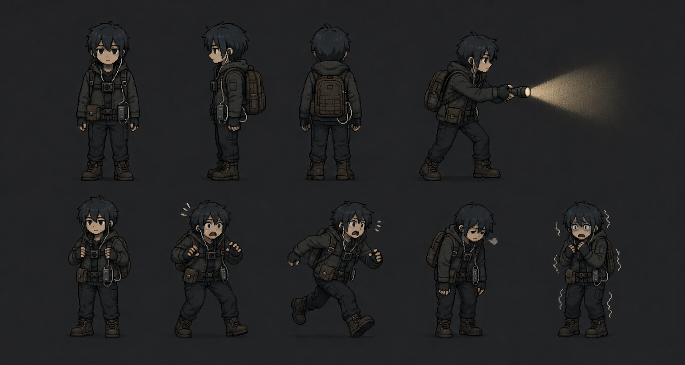
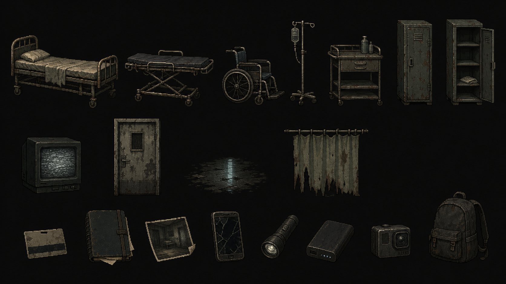
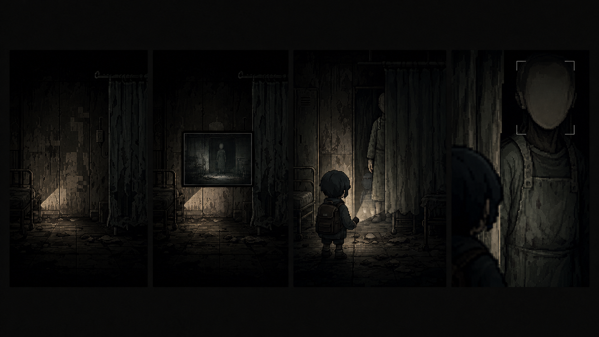

# HorroLive Art & Asset Bible v4

## 0. 文書情報

- 状態: vertical slice制作仕様
- 基準コミット: `9bde30b`
- 参照: [Creative Direction v4](CREATIVE_DIRECTION_V4.md)
- 参照ボード: [horrolive-direction-board.png](reference/horrolive-direction-board.png)
- Asset registry: [manifest.v4.json](../assets/manifest.v4.json)

この文書は「どの絵を、どの寸法・レイヤー・命名で作るか」を固定する。コンセプト画像とランタイム素材は別物として扱う。

## 1. 現状

現行`assets`にはランタイム用PNG、WebP、SVG、音声、sprite atlasがない。

- 主人公: `src/game/playerSprite.ts`の矩形集合
- 背景／小物／怪異: `src/utils/pixelScene.ts`のCanvas描画
- タイトル: `TitleScreenV2.tsx`のインラインSVG
- 音: Web Audioによる合成

したがって、画像を配置するだけではゲームへ表示されない。ランタイム投入時はAsset Registry、画像プリロード、`ImageBitmap`または`HTMLImageElement`、atlas描画、fallbackを実装する。

## 2. アセット成熟度

| 状態 | 意味 |
| --- | --- |
| `concept` | 形、比率、素材、ムードを決める参考画像 |
| `concept-approved` | 方向性の基準として承認済み |
| `production-source` | Aseprite等の編集可能な原本 |
| `runtime-ready` | grid、palette、pivot、alpha、命名を検品済み |
| `integrated` | manifest経由で実装し、Main/PIP双方を確認済み |

AI生成画像は`concept`または`concept-approved`まで。そのまま`runtime-ready`にしない。

## 3. 技術契約

### 3.1 Canvas

| 項目 | 基準 |
| --- | --- |
| Main logical | 640×300 |
| Floor baseline | y=238 |
| PIP output | 320×180 |
| PIP source | Mainと同じcanonical snapshot |
| Scaling | nearest-neighbor |
| Coordinates | 整数 |
| Color | sRGB |
| Runtime format | RGBA PNG + JSON manifest |
| Editable source | Aseprite推奨 |

`imageSmoothingEnabled = false`をMain、PIP、オフスクリーンCanvasすべてで維持する。

### 3.2 レイヤー

```text
00_bg_far
10_bg_structure
20_world_props
30_world_stains_reflections
40_paranormal_world
50_character
60_foreground_occluder
70_light_mask
80_paranormal_pip
90_channel_postprocess
```

- PIP用の別背景を作らない。
- 怪異にscanline、圧縮、色収差を焼き込まない。
- 前景遮蔽物はalpha画像だけでなく、光遮蔽maskと当たり判定情報を持つ。
- 濡れ反射は床本体へ統合せず、強度をチャンネル別に変えられる層へ置く。

## 4. ディレクション画像

### 4.1 主人公



- ファイル: `assets/concepts/character-direction-v4.png`
- Prompt: `assets/concepts/character-direction-v4.prompt.md`
- 状態: `concept-approved`
- 採用するもの: 三面の比率、黒髪、胸カメラ、配線、腰ポーチ、バックパック、重い靴、ライトを両手で構える姿勢、感情による重心差
- そのまま使わないもの: 高解像度の陰影、輪郭の細部、自由なサブピクセル、背景グラデーション

### 4.2 病院小物



- ファイル: `assets/concepts/hospital-props-direction-v4.png`
- Prompt: `assets/concepts/hospital-props-direction-v4.prompt.md`
- 状態: `concept-approved`
- 採用するもの: 錆と灰緑の比率、薄い暖色ハイライト、素材の重量、物体間の年代統一、生活痕跡
- そのまま使わないもの: 個々に異なる光源、過密な表面ノイズ、ランタイム縮小で潰れる1px未満の情報

### 4.3 観測者



- ファイル: `assets/concepts/observer-direction-v4-v2.png`
- Prompt: `assets/concepts/observer-direction-v4-v2.prompt.md`
- 初稿: `assets/concepts/observer-direction-v4.png`
- 状態: `concept-approved`
- 採用条件: 4段階で同じ輪郭と装束を保ち、顔を説明しすぎず、遮蔽と距離で接近を表現すること

## 5. 主人公runtime仕様

### 5.1 Grid

- body envelope: 48×72px
- atlas cell: 64×80px
- pivot: `[32, 76]`
- 足裏: pivotより上4px以内
- 装備張り出し: cell内
- scene内見かけ身長: 60–69pxを目標
- silhouette padding: 左右2px以上、上2px以上

現行59×69矩形spriteから置換するときも、足元位置とライトsocketを維持する。

### 5.2 P0 animation

| State | Frames | fps | 備考 |
| --- | ---: | ---: | --- |
| idle | 2 | 4 | 呼吸は肩1px |
| walk | 4 | 8 | 上下1px、重い接地 |
| run | 4 | 10 | vertical sliceで残す場合 |
| crouch | 2 | 6 | しゃがみ保持 |
| aim | 2 | 6 | ライトsocket固定 |
| interact | 3 | 8 | 対象へ手を伸ばす |
| capture | 3 | 8 | 胸カメラではなくPIP確認の動作 |
| startle | 3 | 8 | 一歩後ろへ重心 |
| fatigue | 2 | 4 | 首と肘が落ちる |
| turn | 3 | 8 | PIPを気にする振り向き |

基本は右向き。walk／idleは水平反転可。aim／captureはライトと配線の向きを確認し、必要なら左向きを個別修正する。

### 5.3 Socket

| ID | 用途 |
| --- | --- |
| `feet` | 床への接地 |
| `flashlight` | 光円錐の始点 |
| `chest_camera` | PIPと装備発光 |
| `earpiece` | 音響侵食の小さな反応 |
| `backpack` | ケーブル／battery状態 |

`flashlight`は現行`playerSprite.ts`のsocketと目視位置が変わらないよう、統合テストを置く。

## 6. 観測者runtime仕様

一体を距離別に作る。別怪異の流用で近づけない。

| Asset | Envelope | Channel | Motion |
| --- | --- | --- | --- |
| `observer_artifact_t0` | 24×56 | PIP postprocess | 人物を描かず欠損だけ |
| `observer_far_t1` | 24×68 | PIP only | 4fps、裾1px |
| `observer_mid_t2` | 32×72 | PIP + brief bleed | 指先または肩1px |
| `observer_near_t3` | 64×80部分像 | PIP + partial Main | 顔ではなくAF枠が動く |

必要データ:

- `worldAlpha`
- `pipAlpha`
- `bleedDurationMs`
- `occlusionMaskId`
- `anchor`
- `faceDetectionBounds`
- `reducedEffectsVariant`

顔、目、口、傷を描き足して怖くしない。遠景と近景で骨格や衣服を変えない。

## 7. 病院environment kit

### 7.1 モジュール

| Module | 論理幅 | 内容 |
| --- | ---: | --- |
| `hospital_entry_01` | 320 | 封鎖入口、窓、紙コップ |
| `hospital_corridor_01` | 320 | ベッド、湿った床、配管 |
| `hospital_ward_01` | 320 | ロッカー、薬品カート、掲示 |
| `hospital_room_01` | 320 | 患者室、カーテン、IV |
| `hospital_exit_01` | 320 | 非常口、壊れた監視モニター |

320px単位で連結し、640px表示内に継ぎ目が二つ以上重ならないようにする。同じ染み、同じ壁紙破れ、同じ照明位置を反復しない。

### 7.2 各モジュールの納品

```text
bg_far.png
bg_structure.png
stains_reflection.png
props.json
foreground_occluder.png
light_occluder.png
collision.json
trigger_zones.json
```

### 7.3 生活痕跡

各モジュールに一つ、1–3秒で意味を想像できる痕跡を置く。小物を散らすだけにしない。

- entry: 半分飲まれた紙コップ
- corridor: ベッド脇の片方だけのスリッパ
- ward: 開いたロッカー内の畳まれた衣服
- room: 書きかけで止まった患者記録
- exit: 充電ケーブル付きの壊れた端末

## 8. Prop仕様

### 8.1 P0

| ID | 目安サイズ | 状態差 | Game role |
| --- | --- | --- | --- |
| `prop_bed_rusted` | 112×64 | シーツ有／無 | 遮蔽、生活痕跡 |
| `prop_gurney` | 96×50 | 高さ2段階 | 遮蔽 |
| `prop_wheelchair` | 56×64 | 向き3段階 | 時間差怪異 |
| `prop_iv_stand` | 28×76 | バッグ有／無 | 細い遮光 |
| `prop_medicine_cart` | 60×62 | 引出し開 | 調査 |
| `prop_locker` | 48×84 | 閉／開 | 観測者の遮蔽 |
| `prop_crt_monitor` | 56×52 | on／off／noise | PIP連動 |
| `prop_room_door` | 64×112 | 閉／半開 | scene境界 |
| `prop_curtain` | 96×100 | 3姿勢 | 前景遮蔽 |
| `prop_wet_reflection` | 96×20 | normal／wrong | 校正 |
| `item_keycard` | 20×12 | pickup | 収集 |
| `item_diary` | 24×20 | pickup | Main/PIP差 |
| `item_old_photo` | 28×22 | pickup | 証拠 |
| `item_battery` | 24×32 | pickup | RIG +25% |

`width`と見かけサイズがゲーム描画で実際に使われるよう、manifest寸法から描画boundsを作る。

### 8.2 Propsのルール

- 接地物は共通の床pivotを持つ。
- 汚れは左右反転しても自然なものと、固有ストーリー汚れを分ける。
- 異常差分はnormal assetを複製せず、変更部分だけのoverlayを優先する。
- 小物へ読ませたい日本語を焼き込まない。文字はruntime text layerにする。
- 車椅子やベッドを怪異そのものより明るくしない。

## 9. UI

UI iconはrepo-native SVGまたはCSSで作り、生成画像へ文字を焼かない。

P0:

- LIVE dot
- Viewer
- RIG battery 4段階
- Chapter
- Capture reticle
- Objective toast
- ChatのHuman／Hint／System／Corrupted
- 新着badge
- ARCHIVE
- HELP
- SETTINGS
- 暗部calibration
- rotate prompt
- touch controls
- keyboard focus

枠線`#242824`、角丸0–3px。赤`#8A2026`はLIVE、危険、侵食だけ。PIP内のscanlineやノイズをMain UIへ広げない。

## 10. FX

基本はコード／shader／Canvas処理。静止画像として焼かない。

| FX | 実装 | 検品 |
| --- | --- | --- |
| Flashlight cone | Canvas gradient + occlusion mask | 50–64°、90–140ms慣性 |
| Dust | seeded particles | 手掛かりを隠さない |
| Wet reflection | reflection layer + mask | Main/PIP差を許可 |
| Block compression | PIP postprocess | 輪郭を完全に消さない |
| Frame freeze/repeat | snapshot selection | 台本どおりの時間 |
| Horizontal tear | PIP compositing | 2–8px |
| AF hunt | overlay vector | reduced版あり |
| False face box | overlay vector | 実在顔認識を使わない |
| World bleed | paranormal layer | 120–300ms、部分像 |
| Chat corruption | DOM text/state | 読める手掛かりを残す |

乱数はseed可能にし、同じ遭遇をQAで再現できるようにする。

## 11. Audio asset方針

現行Web Audioを残しつつ、必要に応じて短い録音素材を追加する。

- room tone
- ventilation
- fluorescent hum
- shoe variations
- cloth／strap
- earpiece contact
- notification clean／corrupted
- mic handling

44.1kHzまたは48kHz、OGG＋fallback。無音区間も台本データとして管理する。音源名に恐怖の答えを含めない。

## 12. 命名

```text
char_player_walk_r_00.png
char_player_aim_l_01.png
anom_observer_pip_far_00.png
anom_observer_bleed_mid_00.png
prop_hospital_wheelchair_pose_01.png
bg_hospital_ward_01_structure.png
fx_pip_false_face_box.svg
sfx_earpiece_contact_01.ogg
```

- snake_case
- 種別、場所／主体、状態、向き、frame
- `final`、`new`、`latest`を名前に使わない
- variant番号は2桁

## 13. Directory

```text
assets/
  concepts/
  source/
    characters/
    anomalies/
    environments/
    props/
  runtime/
    atlases/
    environments/
    ui/
    audio/
  manifest.v4.json
```

編集原本を`runtime`へ置かない。生成したコンセプトとプロンプトを対で保存する。

## 14. P0納品一覧

### Character

- 三面・装備・5感情concept
- atlas source
- P0 animations
- socket JSON
- silhouette test sheet

### Observer

- 4 tier concept
- far／mid／near runtime sprites
- bleed overlays
- occlusion masks
- reduced effects variant

### Environment

- 5 hospital modules
- foreground／light occluder
- wet reflection
- collision／trigger data

### Props

- 病院小物14種
- normal／anomaly overlays
- evidence thumbnails

### UI／FX

- P0 iconsと全状態
- camera effects
- Chat corruption
- calibration／rotate

## 15. 検品

### Asset単体

- atlas cell、pivot、alpha、paddingがmanifestと一致
- palette逸脱が意図的
- 反転時に装備が破綻しない
- 1x表示でシルエットが読める
- ノイズを焼き込んでいない
- filenameとIDが一致

### 実装

- Mainと遅延PIPで同じworld assetを使う
- PIP専用層がMainへ漏れない
- occluderが光と怪異の両方へ効く
- canvas resizeでpivotがずれない
- RIG batteryの表示が一致
- reduced effectsで手掛かりが残る
- 7つの検証viewportで重なりがない

### Conceptからproductionへ

1. 承認箇所を明記する。
2. 64×80または対象gridへ描き直す。
3. role paletteへ減色する。
4. 輪郭を整数pxで清掃する。
5. pivot、socket、occluderを付与する。
6. Main/PIPで検証する。
7. `runtime-ready`へ更新する。

コンセプト画像を縮小しただけの素材は受け入れない。
