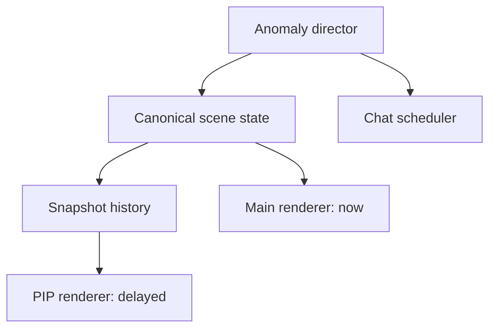

# HorroLive Design Freeze v3.1

> Historical document. Current creative decisions are defined in [Creative Direction v4](CREATIVE_DIRECTION_V4.md), [Vertical Slice & Gimmick Direction v4](VERTICAL_SLICE_GIMMICKS_V4.md), and [Art & Asset Bible v4](ART_ASSET_BIBLE_V4.md).

## 0. Document status

This document is the implementation-ready design freeze for the next HorroLive pass.
It supplements the supplied `HorroLive Art Direction & UX Specification v3` and overrides it where the two differ.

- Repository: `https://github.com/shinya-chigita/horroLive.git`
- Current baseline: `main` at `91f659b365da78a77e1a363691fbcb4573c8e187`
- Current production: `https://horrolive.pages.dev/`
- Recommended work branch: `codex/art-direction-v3-1`
- Technical base: React + TypeScript + Vite + Canvas 2D, fully client-side

The supplied direction board is an experience and art-direction reference. Its 11-panel document grid is not a game-screen layout.

## 1. Product promise

**North Star**

> 見えていないのは、こっちかもしれない。

Fear must come from disagreement among three channels:

1. **肉眼 / Main view** — the current world, mostly unreadable outside the flashlight.
2. **配信用カメラ / PIP** — a delayed, low-frame-rate view of the same world plus camera-only phenomena.
3. **コメント欄 / Chat** — notices anomalies first, misreads them, falls silent, or becomes hijacked.

Core loop:

> 探索する → 情報の食い違いに気づく → 立ち止まって比較する → 記録・移動・無視を選ぶ → 注目が増える → リスクが上がる

The design is successful only if the player repeatedly stops moving to compare channels. A visually dark side-scroller without that decision loop is not HorroLive v3.

## 2. Scope of the next implementation pass

Build one 60–90 second vertical slice before expanding all five location families.

Included:

- Hospital corridor + one hospital room
- One camera-only apparition
- One viewer-count approach event
- One chat-first / chat-hijack event
- Four risk tiers: 237 → 2,370 → 23,700 → 237,000
- Main/PIP shared world state and delayed PIP history
- Correct chat follow/pause behavior
- Desktop and mobile-landscape layouts
- Title, play, journal/help/settings overlays, chapter transition, and one ending

Deferred until the slice proves the loop:

- Abandoned school, religious facility, and underground passage expansion
- Free-text player chat
- Additional endings and long-form progression
- Large asset/content expansion

## 3. Screen architecture

### 3.1 Persistent hierarchy

1. Main scene
2. PIP
3. Chat
4. Compact status line
5. On-demand journal, help, and settings

### 3.2 Desktop: width ≥ 1180px

- Root: `height: 100dvh; overflow: hidden; overscroll-behavior: none`
- Status line: 36px high
- Content: `height: calc(100dvh - 36px)`
- Grid: `minmax(0, 1fr) clamp(320px, 25vw, 380px)`
- Main scene: full remaining height; no archive beneath it
- Right rail: PIP at 16:9, Chat fills the remaining height
- Objective: temporary overlay for 5 seconds after start/change; recoverable through Help
- Journal: 380–440px drawer or centered overlay; opening it pauses gameplay

### 3.3 Tablet and compact landscape: 768–1179px

- Main scene fills the viewport below the status line
- PIP overlays the upper-right of the scene at 180–240px width
- Chat is a drawer opened by a persistent compact control
- Opening a drawer that obscures play pauses world, anomaly, viewer, and scripted-chat timers

### 3.4 Small landscape and portrait

- Small landscape keeps the main scene full-screen and PIP visible
- Touch movement occupies the lower-left; flashlight aiming occupies the right half
- Touch targets are at least 44×44 CSS pixels and respect safe-area insets
- Portrait first shows a rotate recommendation, with a visible `縦画面で続ける` action
- Simplified portrait keeps PIP visible and puts Chat in a drawer

### 3.5 Fixed responsive acceptance viewports

- 1440×900
- 1366×768
- 1024×768
- 844×390
- 667×375

No gameplay viewport may create document-page scrolling.

## 4. Application state model

Use explicit application states:

```ts
type AppState =
  | 'BOOT'
  | 'TITLE'
  | 'PLAYING'
  | 'PAUSED'
  | 'JOURNAL'
  | 'HELP'
  | 'SETTINGS'
  | 'CHAPTER_TRANSITION'
  | 'ENDING';
```

Rules:

- `JOURNAL`, `HELP`, `SETTINGS`, browser-hidden state, and mobile drawers that obscure play pause all simulation timers.
- Resuming does not fast-forward queued anomalies or chat events.
- The current four-card bright-red briefing is replaced by one restrained pre-stream calibration/transmission screen or folded into the title.
- LIVE is the continuous broadcast state. The player action is called `CAPTURE / 記録`, not REC.

## 5. Player choices and consequences

### Correct capture

- Adds evidence to Archive
- Advances attention and possibly the risk tier
- Does not use celebratory effects
- May make later anomalies more dangerous

### Move away or ignore

- Avoids the immediate risk increase
- Leaves evidence unresolved
- Does not block basic chapter progression
- Changes evidence completeness and ending outcome

### Mistimed capture

- Costs a small amount of camera battery
- Produces a brief focus/noise failure and skeptical chat response
- Does not instantly kill or hard-lock the player

Do not use missed anomalies as arbitrary instant deaths. Failure must be telegraphed and tied to escalating exposure or a scripted climax.

## 6. Status and hidden values

Always visible:

- LIVE state
- Viewer count
- Chapter/location
- Camera battery

Contextual only:

- Current objective
- Evidence count
- Capture prompt

Internal or indirectly expressed:

- Tension/exposure is conveyed through breathing, stance, audio, PIP instability, and UI corruption; do not show a prominent numeric tension gauge.
- Health is removed from the persistent HUD. If retained internally for compatibility, it appears only after damage or near failure.

Viewer count is a narrative risk display, not a score. Internally use a monotonic tier:

```ts
type RiskTier = 0 | 1 | 2 | 3;

const VIEWER_BANDS = [237, 2_370, 23_700, 237_000] as const;
```

- Tier 0 / 237: distant ambiguity
- Tier 1 / 2,370: PIP-only detection begins
- Tier 2 / 23,700: near/behind-character interference
- Tier 3 / 237,000: stream hijack and impossible proximity

Each threshold event fires once per chapter. Presentation count and game logic are not directly coupled to arbitrary score increments.

## 7. Shared scene and PIP time model

Maintain one canonical scene state and a short snapshot history buffer.



Layer order:

1. Background
2. World props
3. Paranormal channel layers
4. Character
5. Lighting mask
6. Post-processing

PIP rules:

- Chest-mounted forward camera, broadly aligned with flashlight direction
- Normal delay: 400–700ms
- Visual frame rate: 12–18fps
- History buffer: at least 2 seconds
- Nearest-neighbor upscaling from a low logical resolution
- At higher tiers: 250–900ms freeze, repeated frames, skipped frames, exposure pumping, or horizontal displacement
- Camera-only apparitions are channel-layer visibility changes, not future prediction
- Main and PIP never use unrelated random scenes

## 8. Anomaly director

State sequence:

```text
DORMANT → TELEGRAPH → ACTIVE → RECORDED | IGNORED | MISSED → AFTERMATH → COMPLETE
```

Rules:

- Normally only one major anomaly is `ACTIVE`
- A readable telegraph precedes any meaningful penalty
- Event chat preempts ambient random chat
- Leaving the trigger zone, repeatability, cooldown, and retry behavior are data
- Randomness is seeded for testability
- Reduced-effects mode preserves every clue and resolution path

Recommended type:

```ts
interface AnomalyDefinition {
  id: string;
  sceneId: string;
  trigger: TriggerDefinition;
  channelTimeline: ChannelCue[];
  activeWindowMs: number;
  resolution: ResolutionRule;
  repeatPolicy: 'once' | 'retry' | 'cooldown';
  priority: number;
  chatScript: ChatCue[];
  cameraEffects: CameraEffectCue[];
  reducedEffectsVariant: ReducedEffectDefinition;
}
```

Use semantic scene/object/trigger identifiers. Do not branch game logic directly on raw X-coordinate ranges.

## 9. Chat behavior

The vertical slice uses read-only narrative chat. Free-text posting is deferred until it has a real mechanic.

Follow rules:

- Bottom distance ≤32px: `FOLLOWING`
- Bottom distance >32px: `PAUSED`
- New messages auto-follow only in `FOLLOWING`
- In `PAUSED`, new messages do not change `scrollTop`
- Show `新着 n件`; button press scrolls to the bottom and clears unread count
- Manually returning to the bottom resumes `FOLLOWING`
- Time alone never resumes following
- If old rows are pruned while paused, compensate the removed height so the reading position does not jump
- Use `role="log"`; enable polite live announcements only while following

Narrative pacing:

- Ambient: one message every 2–4 seconds
- Event burst: 3–6 scripted messages
- Silence is an intentional state
- Human, hint, system, and corrupted messages differ mostly through wording and spacing, not bright colors or badges
- Hijacked chat uses fictional in-game information only; never collect or display real IP, location, device, or account data

## 10. Visual and asset rules

- Main scene keeps 70–80% of pixels below relative luminance 0.03
- Strong highlights occupy no more than roughly 2% of the frame
- Red normally occupies less than 1% and is reserved for LIVE, danger, or corruption
- Flashlight: `#D1B68B`, total cone 50–64°, 220–300 logical-pixel reach on a 360px-high scene
- Flashlight aim follows input with 90–140ms inertia
- One ambient light pool per scene, usually alpha 0.06–0.12
- Borders: 1px `#242824`
- Radius: 0–3px everywhere; no 4px exception
- No glass cards, bright gradients, floating shadows, or glossy red CTA
- UI remains legible; the strongest scanlines/noise stay inside the PIP

Character:

- Approximately 18–22% of scene height
- Head no more than 32% of total height
- Backpack, flashlight arm, and chest camera readable in silhouette
- 8–10fps sprite animation; 1–2 logical-pixel vertical walk movement
- Weighted, cautious motion; no mascot bounce
- Prefer a consistent 48×72 logical-pixel sprite atlas over repeatedly hand-building the body from unrelated rectangles

Monster visibility:

- Camera-only: world alpha 0; PIP alpha roughly 0.22–0.45
- Occluded: 40–70% of the body hidden
- World bleed: normally 120–450ms and never full-body + frontal + evenly lit at once

## 11. Audio and accessibility

- Footsteps, breathing, room tone, ventilation, and notification corruption carry information; music is sparse
- Provide Master, ambience, and effects volume plus mute
- Use silence before mismatch events
- Apply `prefers-reduced-motion` as the initial setting
- Do not exceed three full-screen flashes per second
- Reduced effects lowers shake, exposure flicker, sudden zoom, and stinger intensity without removing clues
- Provide visual equivalents for meaningful audio cues
- All flows are keyboard-operable
- Overlays trap focus, close with Esc, and restore focus to the invoking control
- Do not encode state by color alone
- Verify body/chat text at 4.5:1 contrast or better
- Add a dark-scene calibration screen instead of a generic brightness slider

## 12. Current-main gap assessment

Already present on `main`:

- Direction-board palette and low-tech broadcast styling
- Revised pixel character and environment rendering
- Warm flashlight and dark environment
- PIP noise/freeze styling
- Camera-only anomaly concept
- Chat follow/pause/new-message behavior
- Title copy and Cloudflare-hosted production build

Still required:

- Remove the permanent archive panel and page scrolling
- Replace the dense objective/status chrome with the fixed hierarchy above
- Replace the glossy, rounded, bright-red briefing controls
- Add explicit app/overlay pause states
- Build canonical scene snapshots and delayed PIP history
- Replace hard-coded X-driven anomaly behavior with scene definitions and an anomaly director
- Make viewer bands the risk-tier system instead of arbitrary score increments
- Reduce/indirectly express tension and health UI
- Freeze responsive layouts and touch controls
- Add deterministic tests for chat, anomaly transitions, PIP-only visibility, and risk thresholds

## 13. Acceptance criteria

The slice is ready only when all are true:

- Main scene is the first focus, followed by PIP and Chat
- No page scrolling, clipped controls, or touch overlap at all five target viewports
- Journal/help/settings pause every simulation timer
- PAUSED chat changes `scrollTop` by at most 1px while five new messages arrive
- `新着 5件` returns to the bottom and resets unread count
- A PIP-only apparition is never drawn in the main view
- The PIP visibly renders a delayed canonical snapshot, including freeze/repeat behavior
- Each viewer threshold fires its defined event exactly once
- Correct capture, ignore, and mistimed capture all have distinct, understandable outcomes
- Reduced-effects mode preserves the same clues and resolution paths
- Character animation and PIP cadence are independently limited to 8–10fps and 12–18fps
- Canvas resize preserves render and interaction coordinates
- Latest Chrome/Edge, iOS Safari, and Android Chrome complete the slice
- `npm ci`, `npm run lint`, `npm run build`, and focused automated tests pass
- A Cloudflare Pages preview succeeds before merge

## 14. Implementation order

1. Commit this document and the desktop/mobile wireframes
2. Refactor `AppV2` into explicit app and overlay states
3. Lock the `100dvh` desktop/mobile screen architecture
4. Move Archive to a pausing overlay/drawer
5. Extract scene definitions and canonical snapshots
6. Implement delayed PIP history
7. Implement anomaly director and risk tiers
8. Retune title, briefing, status, character, light, Chat, and audio
9. Add automated behavior tests and five-viewport visual QA
10. Deploy preview, review screenshots, and merge after acceptance criteria pass

The correct next milestone is the hospital vertical slice, not simultaneous production of all five environments.
