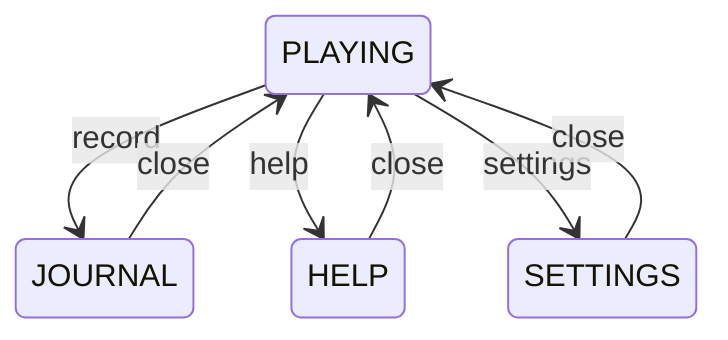

# HorroLive v3.1 Wireframes

These wireframes are binding layout references for the hospital vertical slice.
The art-direction board is not a literal dashboard layout.

## Desktop — 1180px and wider

```text
┌──────────────────────────────────────────────────────────────────────────────┐
│ LIVE  2,370     CH 01 / 廃病院入口        BAT 84%           [記録][音][設定] │ 36px
├──────────────────────────────────────────────────────────┬───────────────────┤
│                                                          │ REC / CAM-01      │
│                                                          │ ┌───────────────┐ │
│                                                          │ │ delayed PIP   │ │ 16:9
│                    MAIN SCENE                            │ └───────────────┘ │
│             current world + flashlight                   ├───────────────────┤
│                                                          │ LIVE CHAT         │
│                                                          │                   │
│                                                          │                   │
│                                              [CAPTURE]   │    [新着 3件]     │
└──────────────────────────────────────────────────────────┴───────────────────┘
```

- Root is exactly `100dvh`; the document never scrolls during play.
- Right rail width is `clamp(320px, 25vw, 380px)`.
- Objective appears over the upper-left of the Main Scene for five seconds.
- Journal, Help, and Settings open above this layout and pause simulation.

## Tablet / compact landscape — 768px to 1179px

```text
┌──────────────────────────────────────────────────────────────────────────────┐
│ LIVE  2,370          CH 01          BAT 84%       [CHAT][記録][音][設定]      │
├──────────────────────────────────────────────────────────────────────────────┤
│                                                    ┌───────────────────────┐ │
│                                                    │ delayed PIP           │ │
│                                                    └───────────────────────┘ │
│                              MAIN SCENE                                      │
│                                                                              │
│ [◀][▶]                                                   [灯][調][CAPTURE]  │
└──────────────────────────────────────────────────────────────────────────────┘
```

- PIP stays visible as an upper-right overlay.
- Chat is a pausing side drawer; it does not become a vertically stacked page.
- Touch controls remain visible for typical 844–932px phone-landscape widths.

## Small landscape

```text
┌──────────────────────────────────────────────────────────┐
│ LIVE 23,700     BAT 63%          [CHAT][記録][音]        │
├──────────────────────────────────────────────────────────┤
│                                  ┌─────────────────────┐ │
│                                  │ PIP                 │ │
│                                  └─────────────────────┘ │
│                    MAIN SCENE                            │
│                                                        │
│ [◀][▶]                               [灯][調][CAPTURE] │
└──────────────────────────────────────────────────────────┘
```

- Controls are at least 44×44 CSS pixels and respect safe-area insets.
- Left side controls movement; the right half of the scene aims the flashlight.

## Overlay behavior



All three overlays pause world motion, anomaly timing, viewer changes, and scripted Chat.

## Required visual checks

- 1440×900
- 1366×768
- 1024×768
- 844×390
- 667×375

At every size: no page scroll, no clipped Main Scene, PIP remains visible, and controls do not cover the character or flashlight target.
